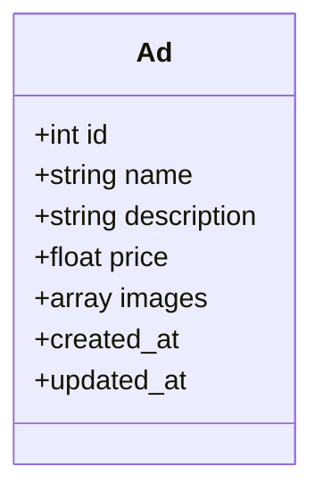
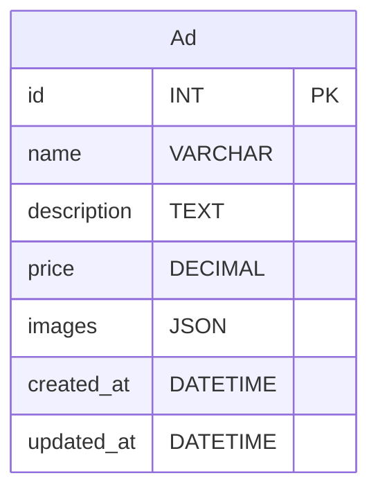
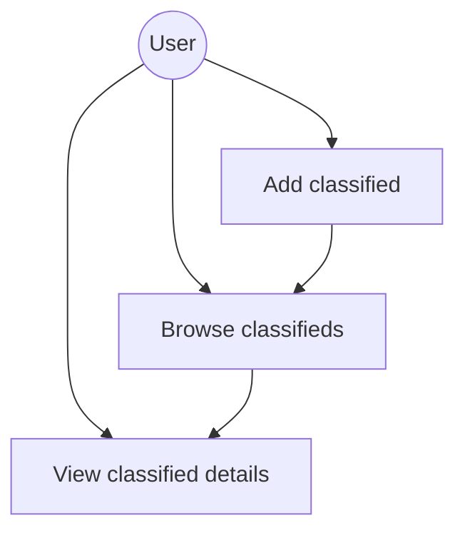
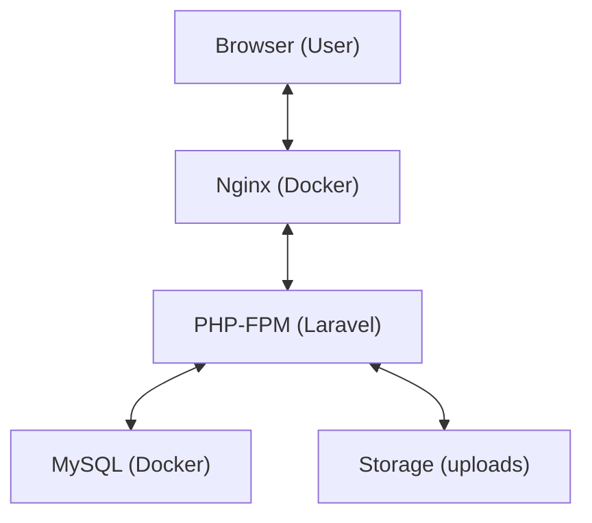

# Classifieds – Laravel 12 + Docker

## Project Description
A web application for managing classifieds (add, browse, validate, upload images) built with Laravel 12 and running in a Docker environment. UI based on Blade and Tailwind CSS. Includes unit and feature tests, seeders, security (XSS, SQLi, CSRF), ready for development and deployment.

---

## Technology Stack
- **PHP 8.x** (Docker)
- **Laravel 12**
- **MySQL** (Docker)
- **Nginx** (Docker)
- **Blade** (templates)
- **Tailwind CSS** (CDN)
- **Alpine.js** (popups)
- **PHPUnit** (tests)
- **Docker Compose**

---

## Features
- Add classifieds (name, description, price, up to 5 images)
- Backend validation (Laravel FormRequest) and frontend (JS)
- Browse classifieds as a dashboard (thumbnails, cards)
- Single ad view with image gallery
- Pagination
- Alerts (popups) after adding an ad
- Unit and feature tests (PHPUnit)
- Seeders with sample ads and images
- Security: XSS, SQL Injection, CSRF

---

## Directory Structure
```
├── src/
│   ├── app/                # application logic (controllers, models, middleware)
│   ├── database/           # migrations, seeders, factories
│   ├── public/             # public files, index.php
│   ├── resources/views/    # Blade views
│   ├── routes/             # route definitions
│   ├── storage/            # uploads, cache, logs
│   └── tests/              # unit and feature tests
├── docker-compose.yml      # Docker config
├── Dockerfile              # PHP image
├── nginx/                  # nginx config
├── .env.example            # example environment config
├── .gitignore              # git exclusions
└── README.en.md            # this file
```

---

## Running the Project
1. **Requirements:** Docker, Docker Compose
2. **Clone the repo:**
   ```bash
   git clone ...
   cd mobilem.nl
   ```
3. **Start the environment:**
   ```bash
   docker compose up --build
   ```
4. **Install dependencies and migrate:**
   ```bash
   docker compose exec app bash
   cd src
   composer install
   cp .env.example .env
   php artisan key:generate
   php artisan migrate --seed
   exit
   ```
5. **App available at:**
   - http://localhost:8080

---

## Tests
```bash
docker compose exec app bash -c "cd src && php artisan test"
```

---

## Security
- **XSS:** Data displayed via `e()` in views
- **SQL Injection:** Eloquent, ID tests
- **CSRF:** Middleware, tokens, API exceptions
- **Validation:** Backend (FormRequest), frontend (JS)

---

## Seeders
- Default ads with thumbnails (logo_small.png, logo.png) – see `DemoAdsSeeder`

---

## UML Diagram (Ad class)


## ERD Diagram (ads table)


---

## UseCase Diagram


## Architecture Diagram


---

## HTTP Endpoints
| Method | Endpoint         | Name         | Description                                                      |
|--------|------------------|--------------|------------------------------------------------------------------|
| GET    | /                | -            | Redirects to classifieds list (`/ads`)                           |
| GET    | /ads             | ads.index    | Shows classifieds list (dashboard, pagination, thumbnails)       |
| GET    | /ads/create      | ads.create   | Form to add a new classified                                     |
| POST   | /ads             | ads.store    | Saves new classified (validation, image upload)                  |
| GET    | /ads/{ad}        | ads.show     | Classified details (description, image gallery, price)           |
| GET    | /ads/{ad}/edit   | ads.edit     | (NOT IMPLEMENTED) Edit classified form                          |
| PUT    | /ads/{ad}        | ads.update   | (NOT IMPLEMENTED) Update classified                             |
| DELETE | /ads/{ad}        | ads.destroy  | (NOT IMPLEMENTED) Delete classified                             |

---

## Project Completeness Summary
The project contains all key elements:
- Model: `Ad.php` (and `User.php`)
- Controller: `AdController.php`
- Middleware: only `VerifyCsrfToken.php` (best practice)
- Migration: `2025_06_27_072549_create_ads_table.php` (and system)
- Seeders: `DemoAdsSeeder.php`, `DatabaseSeeder.php`
- Layout: `app.blade.php`
- Classifieds views: `index.blade.php`, `show.blade.php`, `create.blade.php`
- Public files: `index.php`, `.htaccess`, favicon, robots.txt
- Config files: `.env.example`, `.gitignore`, `README.en.md`, `composer.json`, `docker-compose.yml`, `Dockerfile`, `nginx/`
- Tests: `tests/` directory

No unnecessary files – directories are clean, no redundant middleware or old files.

The project is ready for development, testing, and deployment.

---

## Author
Grzegorz Skotniczny 