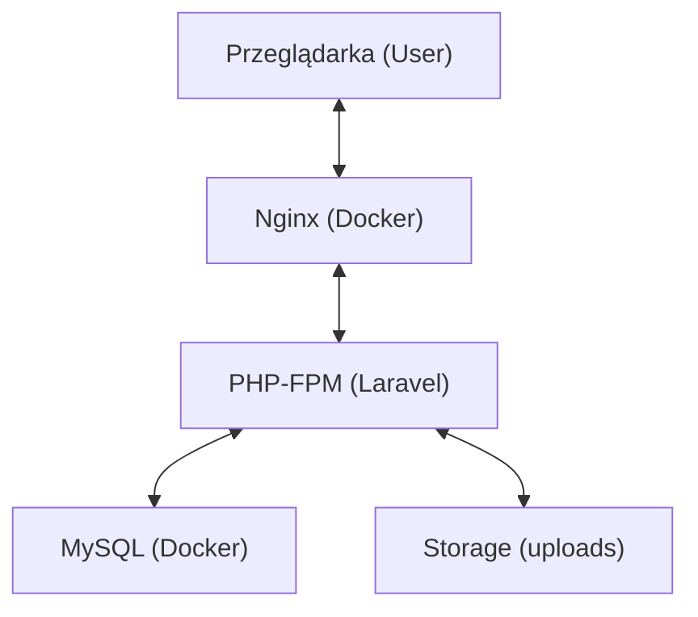
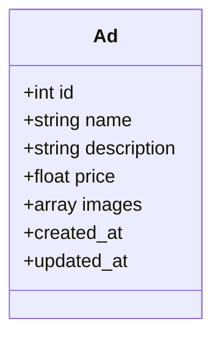
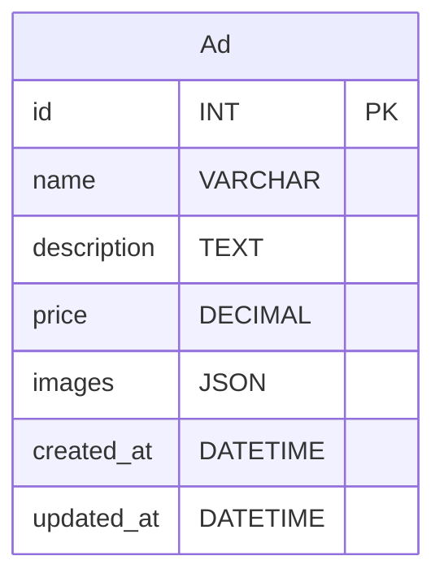
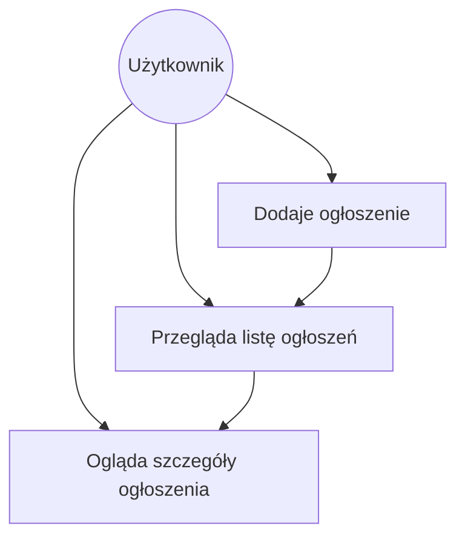

# Ogłoszenia – Laravel 12 + Docker

## Opis projektu
Aplikacja do zarządzania ogłoszeniami (dodawanie, przeglądanie, walidacja, upload zdjęć) napisana w Laravel 12, uruchamiana w środowisku Docker. UI oparty o Blade i Tailwind CSS. Testy jednostkowe i feature, seedery, bezpieczeństwo (XSS, SQLi, CSRF), gotowa do rozwoju i wdrożenia.

---

## Stos technologiczny
- **PHP 8.x** (Docker)
- **Laravel 12**
- **MySQL** (Docker)
- **Nginx** (Docker)
- **Blade** (szablony)
- **Tailwind CSS** (CDN)
- **Alpine.js** (popupy)
- **PHPUnit** (testy)
- **Docker Compose**

---

## Funkcje
- Dodawanie ogłoszeń (nazwa, opis, cena, max 5 zdjęć)
- Walidacja po stronie backendu (Laravel FormRequest) i frontend (JS)
- Przeglądanie ogłoszeń w formie dashboardu (miniaturki, karty)
- Pojedyncze ogłoszenie z galerią zdjęć
- Paginacja
- Alerty (popupy) po dodaniu ogłoszenia
- Testy unit i feature (PHPUnit)
- Seedery z przykładowymi ogłoszeniami i obrazkami
- Zabezpieczenia: XSS, SQL Injection, CSRF

---

## Struktura katalogów
```
├── src/
│   ├── app/                # logika aplikacji (kontrolery, modele, middleware)
│   ├── database/           # migracje, seedery, fabryki
│   ├── public/             # publiczne pliki, index.php
│   ├── resources/views/    # widoki Blade
│   ├── routes/             # definicje tras
│   ├── storage/            # uploady, cache, logi
│   └── tests/              # testy jednostkowe i feature
├── docker-compose.yml      # konfiguracja Docker
├── Dockerfile              # obraz PHP
├── nginx/                  # konfiguracja nginx
├── .env.example            # przykładowa konfiguracja środowiska
├── .gitignore              # wykluczenia dla gita
└── README.md               # ten plik
```

---

## Uruchomienie projektu
1. **Wymagania:** Docker, Docker Compose
2. **Klonowanie repo:**
   ```bash
   git clone ...
   cd mobilem.nl
   ```
3. **Start środowiska:**
   ```bash
   docker compose up --build
   ```
4. **Instalacja zależności i migracje:**
   ```bash
   docker compose exec app bash
   cd src
   composer install
   cp .env.example .env
   php artisan key:generate
   php artisan migrate --seed
   exit
   ```
5. **Aplikacja dostępna pod:**
   - http://localhost:8080

---

## Testy
```bash
docker compose exec app bash -c "cd src && php artisan test"
```

---

## Bezpieczeństwo
- **XSS:** Dane wyświetlane przez `e()` w widokach
- **SQL Injection:** Eloquent, testy na ID
- **CSRF:** Middleware, tokeny, wyjątki dla API
- **Walidacja:** Backend (FormRequest), frontend (JS)

---

## Seedery
- Domyślne ogłoszenia z miniaturkami (logo_small.png, logo.png) – patrz `DemoAdsSeeder`

---
## Diagram architektury



## Diagram UML (klasa Ad)


## Diagram ERD (tabela ads)


---

## Diagram UseCase




## Endpointy HTTP

| Metoda | Endpoint         | Nazwa         | Opis                                                                 |
|--------|------------------|---------------|----------------------------------------------------------------------|
| GET    | /                | -             | Przekierowanie na listę ogłoszeń (`/ads`)                            |
| GET    | /ads             | ads.index     | Wyświetla listę ogłoszeń (dashboard, paginacja, miniaturki)          |
| GET    | /ads/create      | ads.create    | Formularz dodawania nowego ogłoszenia                                |
| POST   | /ads             | ads.store     | Zapisuje nowe ogłoszenie (walidacja, upload zdjęć)                   |
| GET    | /ads/{ad}        | ads.show      | Szczegóły ogłoszenia (opis, galeria zdjęć, cena)                     |
| GET    | /ads/{ad}/edit   | ads.edit      | (NIEZAIMPLEMENTOWANE) Formularz edycji ogłoszenia                    |
| PUT    | /ads/{ad}        | ads.update    | (NIEZAIMPLEMENTOWANE) Aktualizacja ogłoszenia                        |
| DELETE | /ads/{ad}        | ads.destroy   | (NIEZAIMPLEMENTOWANE) Usuwanie ogłoszenia                            |


## Podsumowanie kompletności projektu
Projekt zawiera wszystkie kluczowe elementy:
- Model: `Ad.php` (oraz `User.php`)
- Kontroler: `AdController.php`
- Middleware: tylko `VerifyCsrfToken.php` (zgodnie z dobrymi praktykami)
- Migracja: `2025_06_27_072549_create_ads_table.php` (i inne systemowe)
- Seedery: `DemoAdsSeeder.php`, `DatabaseSeeder.php`
- Layout: `app.blade.php`
- Widoki ogłoszeń: `index.blade.php`, `show.blade.php`, `create.blade.php`
- Pliki publiczne: `index.php`, `.htaccess`, favicon, robots.txt
- Pliki konfiguracyjne: `.env.example`, `.gitignore`, `README.md`, `composer.json`, `docker-compose.yml`, `Dockerfile`, `nginx/`
- Testy: katalog `tests/`

---

---

## Autor
Grzegorz Skotniczny

---